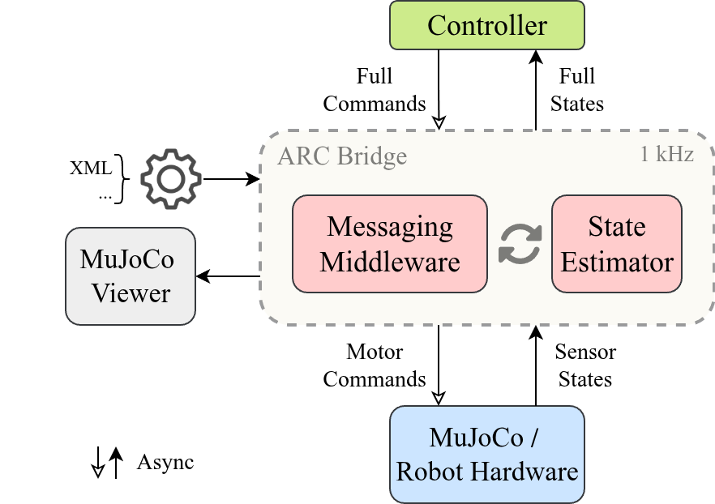

# Agile Robot Control (ARC) Bridge
The ARC Bridge is a cross-platform software bridge of a nominal robot controller to Mujoco simulator via LCM communication protocol.




## Quick Start
1. Make sure you have java installed. Type `javac` to verify.
1. Clone this repo:
    ```sh
    git clone git@github.com:ARCaD-Lab-UM/arc-bridge.git
    ```
1. Create a conda environment:
    ```sh
    conda env create -f environment.yml
    conda activate arcpy
    ```
1. Generate LCM types:
    ```sh
    bash gen_lcm_types.sh # Ubuntu or macOS
    gen_lcm_types_win.cmd # Windows
    ```
    :warning: Restart MATLAB to make changes effective. Redo this if any LCM types are changed.     
1. Install `arc-bridge` as a Python module in editable and compatible mode:
    ```sh
    pip install -e . --no-deps --config-settings editable_mode=compat
    ```
1. Launch it in any terminal with `arcpy` activated:
    ```sh
    arc-bridge # Ubuntu or Windows
    ```
    Use `--help` to find other launching options.
    If you are using macOS, launch it in this repo's root folder:
    ```sh
    mjpython arc_bridge/main.py # macOS
    ```
1. Check the communication status and visualize data:
    ```sh
    arc-lcm-spy
    ```


## Supported Robots & Controllers
:point_down: Click to find the corresponding controller
- [x] [MUPS Hopper](https://github.com/ARCaD-Lab-UM/mups-controller)
- [x] [LimX Tron1 Pointfoot](https://github.com/ARCaD-Lab-UM/tron1-model-based-controller/blob/main/point_foot/MAIN_PF_LCM.m)
- [x] [LimX Tron1 Linefoot](https://github.com/ARCaD-Lab-UM/tron1-model-based-controller/blob/main/line_foot/MAIN_LF_LCM.m)
- [x] [Toy Biped Linefoot](https://github.com/ARCaD-Lab-UM/TrainingWheel/blob/main/control_Cassie/MAIN_cassie_LCM.m)
- [x] [Toy Biped Pointfoot](https://github.com/ARCaD-Lab-UM/TrainingWheel/blob/main/control_tron1/MAIN_tron1_LCM.m)


## Add Your Custom Robot

- For a referenced integration, see the pendulum example added in commit [`bd614b0`](https://github.com/ARCaD-Lab-UM/arc-bridge/commit/bd614b0). 
- Sensors including IMU, joint encoder, foot force, CoM position and velocity are parsed automatically. Check [hopper_model.xml](https://github.com/ARCaD-Lab-UM/arc-bridge/blob/main/robot_assets/Hopper_v2/hopper_model.xml) for an example of a floating-based robot with a common sensor pack.

1. Add your robot's MuJoCo XML files in `robot_assets/`:
    ```
    robot_assets/
    └── YourRobot/
        └── your_robot.xml  # Robot and scene definitions
    ```

2. Define LCM message types in `lcm_types/`:
    ```
    lcm_types/
    ├── your_robot_state_t.lcm    # Robot state message
    └── your_robot_control_t.lcm  # Robot control message
    ```

    **Message structure example**:
    ```lcm
    // your_robot_state_t.lcm
    package lcm_msgs;
    struct your_robot_state_t {
        int64_t timestamp;
        double qj_pos[N];           // Joint positions
        double qj_vel[N];           // Joint velocities  
        double qj_tau[N];           // Joint torques
        // Add robot-specific fields as needed
    }

    // your_robot_control_t.lcm  
    package lcm_msgs;
    struct your_robot_control_t {
        int64_t timestamp;
        double qj_tau[N];           // Desired joint torques
        double qj_pos[N];           // Desired joint positions
        double qj_vel[N];           // Desired joint velocities
        double kp[N];               // Proportional gains
        double kd[N];               // Derivative gains
    }
    ```
    Replace `N` with the number of actuated joints of your robot.

3. Create a robot bridge classin `arc_bridge/bridges/your_robot_bridge.py`:
    ```python
    import mujoco
    import numpy as np

    from .lcm2mujuco_bridge import Lcm2MujocoBridge
    from arc_bridge.lcm_msgs import your_robot_state_t, your_robot_control_t
    from arc_bridge.utils import *


    class YourRobotBridge(Lcm2MujocoBridge):
        def __init__(self, mj_model, mj_data, config):
            super().__init__(mj_model, mj_data, config)

        def parse_robot_specific_low_state(self):
            """Add robot-specific state information to low_state message"""
            # Example: Add inertia matrix and bias forces
            temp_inertia_mat = np.zeros((self.mj_model.nv, self.mj_model.nv))
            mujoco.mj_fullM(self.mj_model, temp_inertia_mat, self.mj_data.qM)
            self.low_state.inertia_mat = temp_inertia_mat.tolist()
            self.low_state.bias_force = self.mj_data.qfrc_bias.tolist()
    ```

4. Register your robot to bridge imports in `arc_bridge/bridges/__init__.py`:
    ```python
    # ... existing robots ...
    from .your_robot_bridge import YourRobotBridge
    ```
5. Register your robot to launching configurations in `arc_bridge/config.py`:
    ```python
    robot_path_dict = {
        # ... existing robots ...
        "your_robot": "YourRobot/robot.xml",
    }
    ```

6. Re-generate LCM Types
    ```bash
    bash gen_lcm_types.sh     # Ubuntu/macOS
    gen_lcm_types_win.cmd     # Windows
    ```


## Dependencies
- [LCM](https://github.com/lcm-proj/lcm)
- [Mujoco](https://github.com/google-deepmind/mujoco)
- Java (LCM type generation and visualization)


## Troubleshooting

<details>
    <summary>  
        <b> For macOS users </b>
    </summary>

Use `mjpython` instead of `python` to launch the bridge.
</details>

<details>
    <summary>  
        <b> For Windows users </b>
    </summary>

Use `arc-bridge --busywait` to avoid inaccurate system clock resolutions.
</details>

<details>
    <summary>  
        <b> LCM messages not found in MATLAB </b>
    </summary>

Restart MATLAB once after generating LCM types.
</details>

<details>
    <summary>  
        <b> GLFW Error </b>
    </summary>

```sh
GLFWError: (65542) b'GLX: No GLXFBConfigs returned'
GLFWError: (65545) b'GLX: Failed to find a suitable GLXFBConfig'
ERROR: could not create window
```
Set NVIDIA GPU as primary renderer (for systems with NVIDIA GPUs)
```
export __NV_PRIME_RENDER_OFFLOAD=1
export __GLX_VENDOR_LIBRARY_NAME=nvidia
```
</details>

<details>
    <summary>
        <b> Unable to install LimX SDK in arcpy </b>
    </summary>

Downgrade `mujoco` to 3.2.2 and `numpy` to 1.21.6 manually.
</details>
